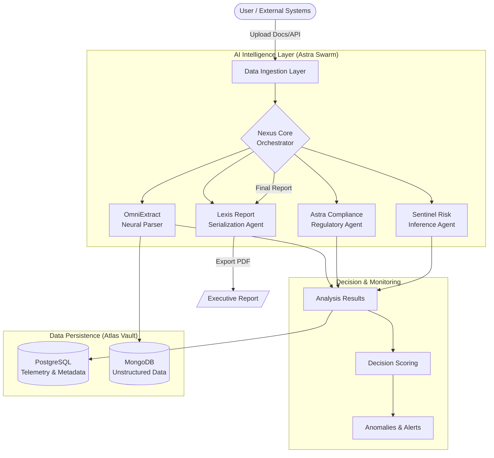

# 🛡️ RiskIQ — Autonomous AI Platform for Financial Compliance & Decision Intelligence

[](https://reactjs.org/)
[](https://vitejs.dev/)
[](https://nodejs.org/)
[](https://expressjs.com/)
[](https://www.postgresql.org/)
[](https://www.mongodb.com/)
[](https://tailwindcss.com/)
[](https://axios-http.com/)

---

## 🚀 Overview

**RiskIQ** is an enterprise-grade, multi-agent AI platform designed to automate financial compliance analysis, document intelligence, and decision support workflows.  

The system transforms complex agreements and structured datasets into actionable insights through autonomous agents, regulatory knowledge integration, and real-time analytics.

RiskIQ demonstrates how modern AI architectures can enhance operational efficiency, improve decision accuracy, and support regulatory readiness for financial institutions such as NBFCs, fintech platforms, and banking organizations.

---

## 🎯 Problem Statement

Financial institutions face increasing regulatory complexity, manual document processing challenges, and fragmented decision workflows, leading to inefficiencies, operational risks, and delayed insights.

RiskIQ addresses this by providing an autonomous AI system capable of analyzing documents, evaluating data, monitoring conditions, and generating intelligent reports within a unified platform.

---

## 🏗️ System Architecture

RiskIQ is built on a modular **multi-agent orchestration architecture**, where specialized AI components collaborate to execute complex workflows.



---

## � Core Intelligence: The Astra Swarm

- **Nexus Core (Orchestrator)**  
  Central coordination engine responsible for workflow routing, agent communication, and execution sequencing.

- **OmniExtract (Document Intelligence Agent)**  
  AI-powered parsing and semantic extraction engine that converts unstructured documents into structured insights.

- **Astra Compliance (Regulatory Agent)**  
  Evaluates extracted data against regulatory and governance rules to compute compliance indicators.

- **Sentinel Risk (Inference Agent)**  
  Performs anomaly detection, threshold monitoring, and machine-learning-based fraud probability scoring.

- **Lexis Report (Reporting Agent)**  
  Generates high-fidelity summaries and downloadable executive PDF reports with deterministic fallbacks.

- **Atlas Vault (Data Layer)**  
  Hybrid storage architecture supporting structured telemetry (Postgres) and deep-extraction storage (MongoDB).

---

## 💎 Platform Capabilities

### 📄 Document Intelligence
- Semantic clause extraction and context understanding.
- Grounded evidence mapping with full citation support.

### 📊 Decision Analytics
- Predictive scoring models (Decision-Level Random Forest).
- Confidence indicators and real-time risk intensity gauging.

### 🔁 Continuous Monitoring
- Autonomous re-evaluation loops and real-time alert streams.
- Adaptive monitoring capability across global session data.

---

## 🛠️ Technology Stack

### **Frontend Resilience**
- **React.js + Vite** for low-latency state management.
- **Tailwind CSS** for a premium "Authoritative UI" aesthetic.
- **Recharts** for wide-aspect temporal analytics.

### **Backend Orchestration**
- **Node.js + Express** for high-concurrency agent routing.
- **Zod** schema validation for cross-agent state integrity.

### **Data Persistence**
- **PostgreSQL** (Grounded telemetry & session metadata).
- **MongoDB** (High-depth document extraction storage).

---

## 🏁 Getting Started

### 1️⃣ Clone & Install
```bash
git clone <repository-url>
cd riskiq/frontend && npm install
cd ../backend-node && npm install
```

### 2️⃣ Configure Environment
Create `.env` files in both directories with your DB credentials and AI API keys.

### 3️⃣ Execute Swarm
```bash
# Start Backend
cd backend-node && npm run dev
# Start Frontend
cd frontend && npm run dev
```

---

## 🏆 Vision
RiskIQ represents a step toward the future of intelligent financial systems — where AI agents collaborate to transform fragmented data into trustworthy, executive-ready decisions.

**RiskIQ — Autonomous Intelligence for Financial Systems** 🛡️🚀
