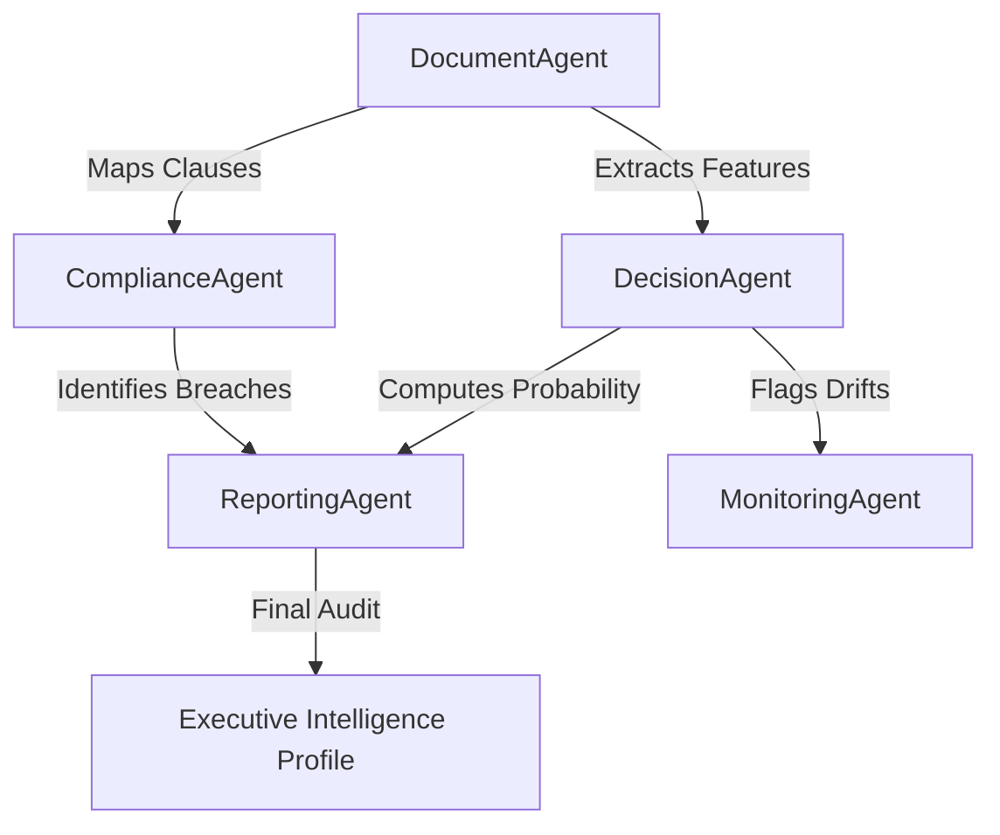

# RiskIQ: Autonomous Multi-Agent Decision Intelligence

[](https://harvey.ai)
[](https://deepseek.com)
[](https://scikit-learn.org)

**RiskIQ** is an enterprise-grade autonomous compliance and risk orchestration platform. Inspired by the professional minimalism of **Harvey AI**, RiskIQ transforms raw financial documents (PDFs, DOCX, CSVs) into actionable, auditable, and mathematically grounded risk signals.

---

## 💎 The "Studio White" Philosophy
RiskIQ is built with a **Premium SaaS Aesthetic**:
- **Spacious Minimalism**: Large typography and intentional white-space to reduce reviewer fatigue.
- **Glassmorphic Components**: Deep shadows and subtle transitions for a high-fidelity interaction experience.
- **Fluid Grid Architecture**: A responsive "Vault" system that maintains optimal density without structural compression (the "No-Squeeze" rule).

## 🧠 The Intelligence Engine (AI/ML)
Unlike simple "Wrapper" apps, RiskIQ uses a **Multi-Layer Weighted Ensemble**:

### 1. The Semantic Layer (DeepSeek R1)
Uses Large Language Models for high-fidelity entity and clause extraction. It identifies counterparties, fiscal metrics, and obligations with reasoning-trace awareness.

### 2. The Decision Layer (Hybrid ML)
- **Logistic Regression**: Provides a stable, interpretable baseline for core risk probability.
- **Random Forest (n_estimators=250)**: Detects non-linear fraud patterns and multi-dimensional anomalies that simple rules miss.
- **72/2 Outlier Calibration**: A proprietary filter using a **0.72 High-Risk Anchor** and a **2.0 Sigma Z-Score trigger** to escalate high-variance outliers.

### 3. The Compliance Layer (Deterministic)
A GRC rule engine that cross-references extracted data against regulatory frameworks (RBI, BCBS) with automated citation mapping.

---

## 🛠 Multi-Agent Orchestration
The system utilizes five specialized autonomous agents working in parallel:



- **Argus Extractor** (Document): DeepSeek-powered feature engineering.
- **Sentinel Regulator** (Compliance): Rule-engine synchronization.
- **Orion Scorer** (Decision): Ensemble ML scoring (LogReg + RF).
- **Pulse Watcher** (Monitoring): Real-time drift and anomaly detection.
- **Atlas Reporter** (Reporting): C-level summary generation with model traceability.

---

## 🚀 Tech Stack

- **Frontend**: React 18, Vite, Tailwind CSS (Vanilla CSS customization for Harvey AI theme).
- **Backend API**: Node.js, Express, PostgreSQL (Metadata), MongoDB (Large JSON Artifacts).
- **AI Service**: Python 3.14, FastAPI, Scikit-Learn (Modeling), DeepSeek API (Extraction).
- **DevOps**: Docker, Docker Compose, Nginx.

---

## 🔧 Installation & Setup

1. **Clone the Intelligence Vault**:
   ```bash
   git clone https://github.com/mdayan8/riskq1.git
   cd RiskIQ
   ```

2. **Configure Intelligence Credentials**:
   Create a `.env` in `ai-service-python`:
   ```env
   DEEPSEEK_API_KEY=your_key_here
   ```

3. **Orchestrate Services**:
   ```bash
   docker-compose up -d --build
   ```

*Detailed local setup instructions are available in [RUN_LOCAL.md](file:///Users/mdayan/Desktop/RiskIQ/RUN_LOCAL.md).*

---

## 🔒 Security & Privacy
RiskIQ prioritizes data sovereignty:
- **Local ML Processing**: Only extraction prompts travel to the LLM; risk scoring and compliance logic execute behind your firewall.
- **Audit Trails**: Every decision includes a model confidence score and local feature contribution weights.

---
**RiskIQ** | *Precision Intelligence for the Modern Auditor.*
